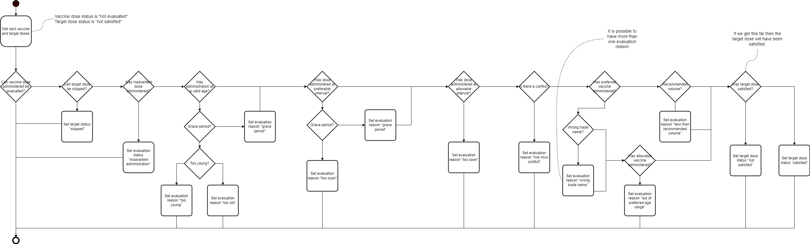

When I was first introduced to the Logic Specification for AICP Recommendations
I thought it was a marvelous document. Here was my tax dollars doing something 
meaningful. I thought that I could build the system as it was described in the 
document. I was wrong.

Over the last few months I've spent more time actually reading the Logic Spec 
and I've come to understand that it isn't a blueprint for a software system
but more akin to an architechtural sketch. To be more than that it needs pictures.

I took the **Figure 6.1 Evaluation Process Model** and unrolled it into a flow
chart. Enlightenment come in many forms.

### Resources
- [Draw.io](https://app.diagrams.net/)
